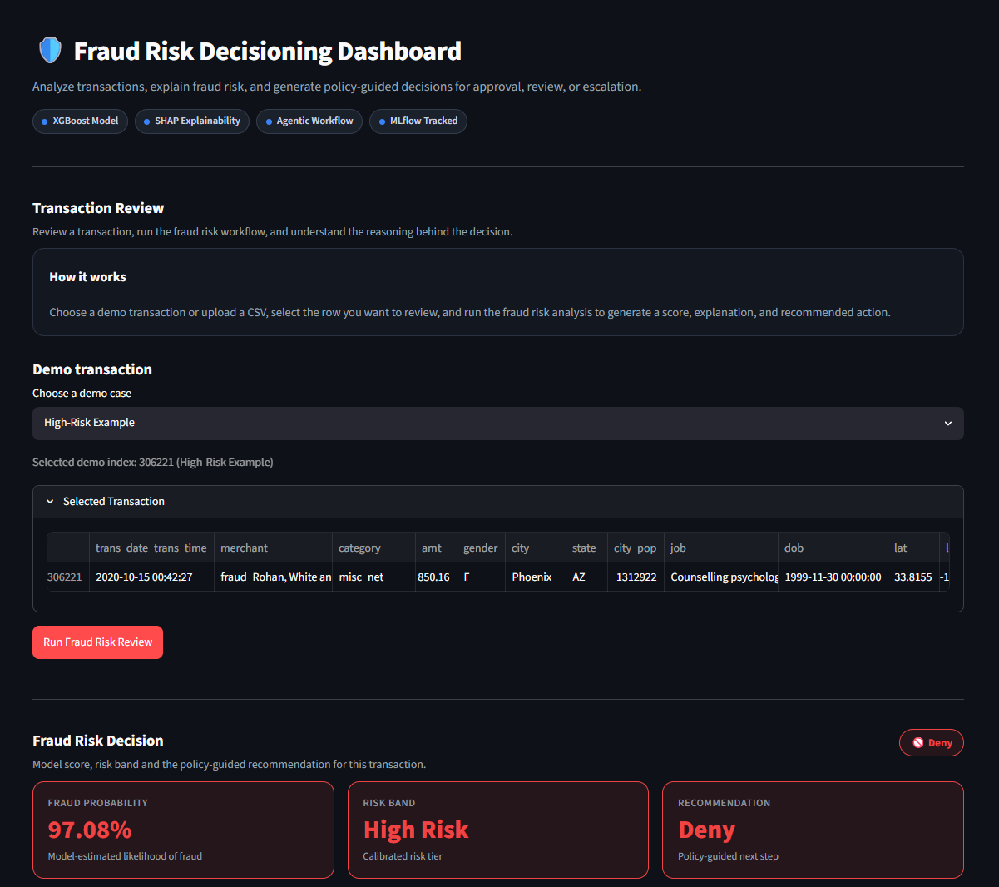
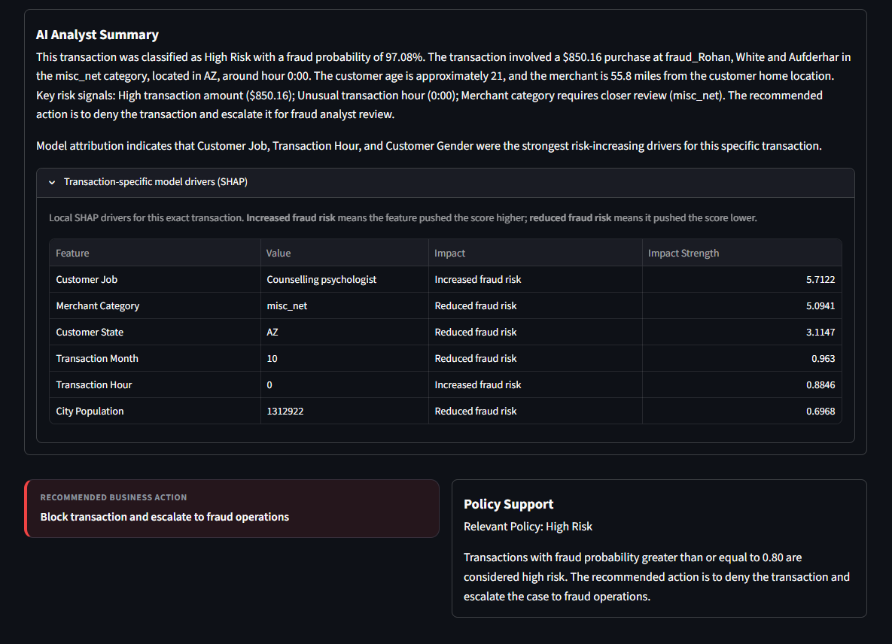
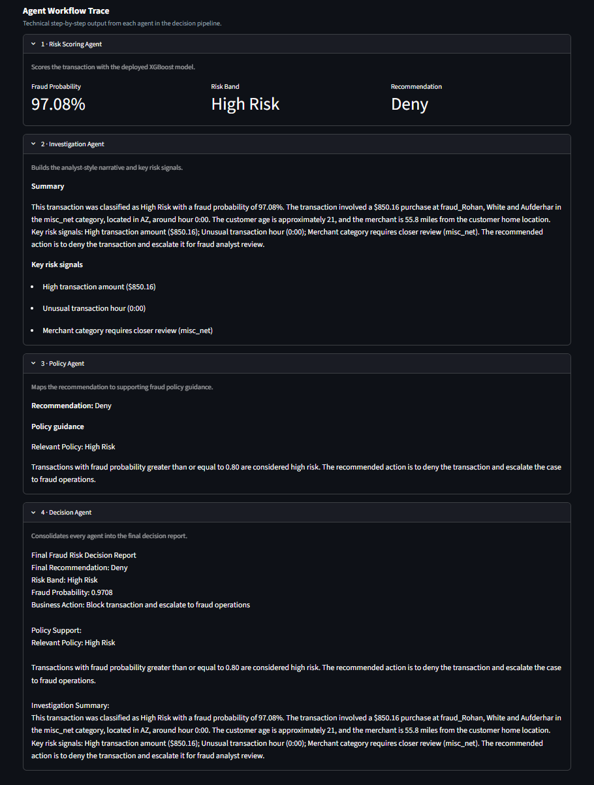
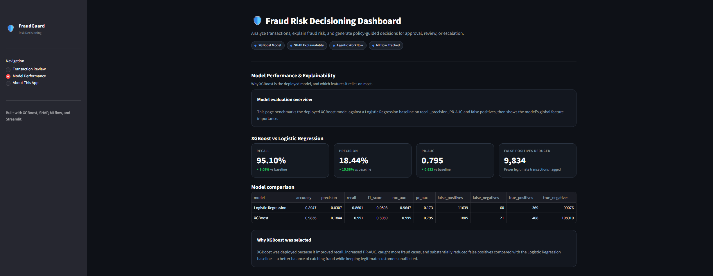
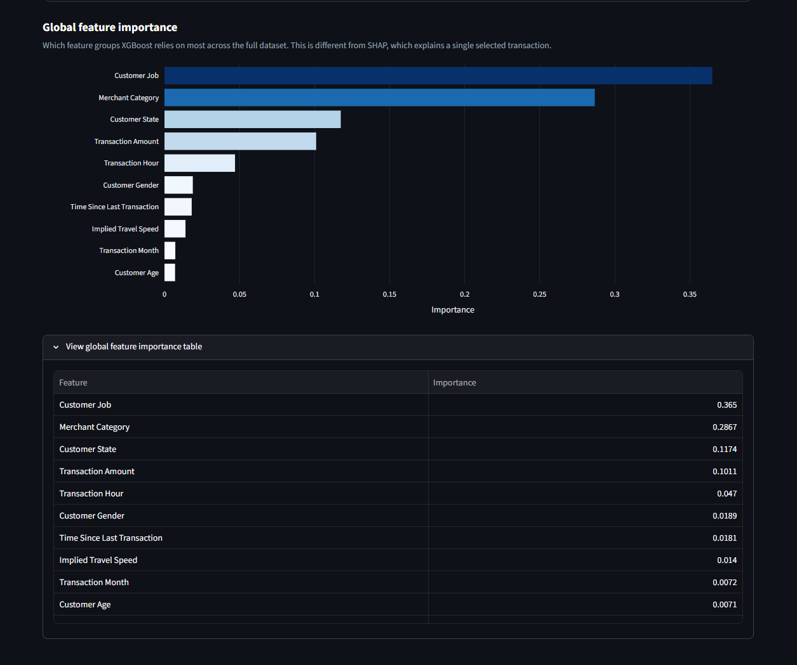
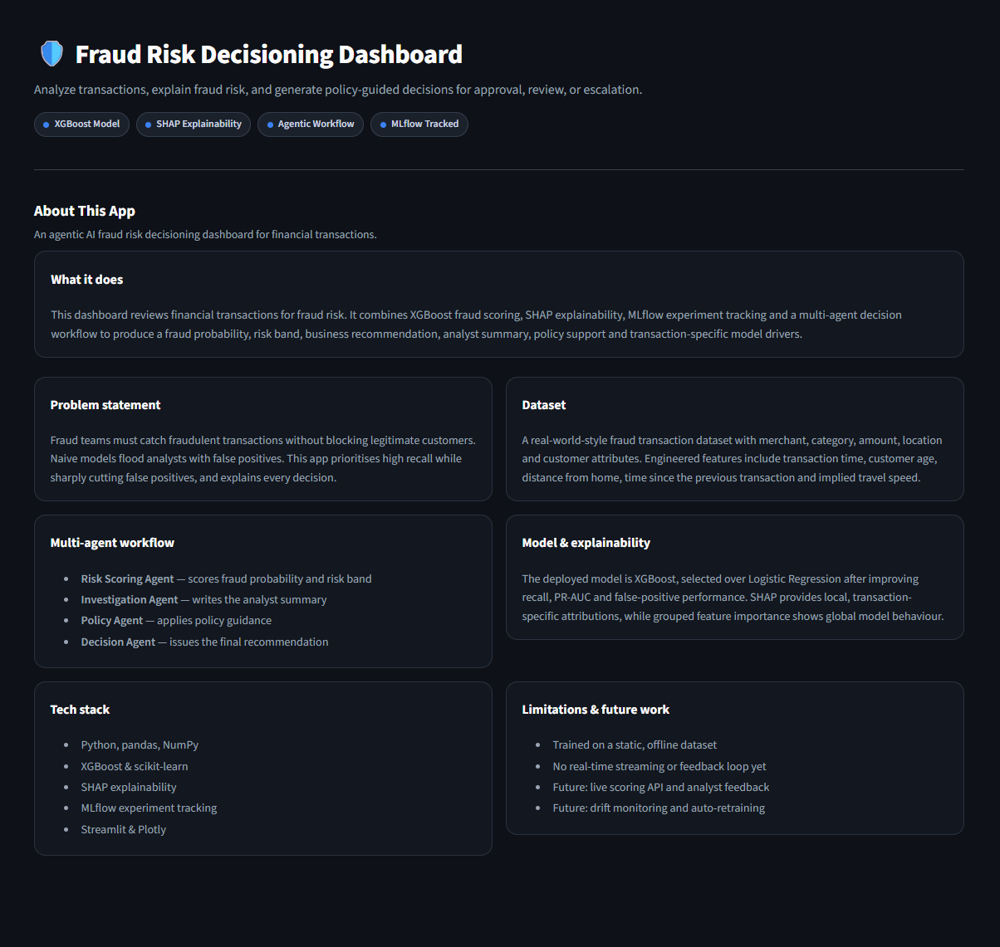

# 🛡️ FraudGuard — Agentic AI Fraud Risk Decisioning Dashboard

A production-style fraud risk decisioning system built with XGBoost, SHAP explainability, MLflow experiment tracking, and a 4-agent AI decisioning workflow. Analyzes financial transactions and generates structured approve / manual review / escalate recommendations with natural-language analyst summaries.

**[🚀 Live Demo →]([https://your-app-url.streamlit.app](https://fraudguard-dashboard.streamlit.app/))**

---

## What It Does

Fraud teams face a core tension: catch as much fraud as possible without blocking legitimate customers. Naive models flood analysts with false positives. This dashboard addresses that by:

- Scoring each transaction with a tuned XGBoost model optimized for **high recall** while sharply reducing false positives
- Explaining *why* a transaction was flagged using **SHAP** at both the global and per-transaction level
- Routing each transaction through a **4-agent decisioning workflow** that produces a risk band, business recommendation, analyst narrative, and policy guidance
- Supporting **CSV upload** for batch review or **demo mode** for instant exploration

---

## Screenshots

### High-Risk Transaction — Fraud Risk Decision


### AI Analyst Summary & SHAP Explainability


### 4-Agent Workflow Trace


### Model Performance — XGBoost vs Logistic Regression


### Global Feature Importance


### About This App


---

## Model Performance

| Model | Recall | Precision | PR-AUC | False Positives | False Negatives |
|---|---|---|---|---|---|
| Logistic Regression (baseline) | 86.01% | 3.07% | 0.173 | 11,639 | 60 |
| **XGBoost (deployed)** | **95.10%** | **18.44%** | **0.795** | **1,805** | **21** |

XGBoost was selected for deployment after benchmarking against a Logistic Regression baseline. It achieved:
- **+9.09%** recall improvement
- **84% reduction** in false positives (11,639 → 1,805)
- **65% reduction** in false negatives (60 → 21)
- **+0.622** PR-AUC improvement

---

## 4-Agent Decisioning Workflow

Each transaction passes through a sequential pipeline of four agents:

| Agent | Role |
|---|---|
| **Risk Scoring Agent** | Runs the XGBoost model, outputs fraud probability and risk band |
| **Investigation Agent** | Builds a natural-language analyst narrative and flags key risk signals |
| **Policy Agent** | Maps the risk band to the relevant fraud policy and guidance |
| **Decision Agent** | Consolidates all agent outputs into a final structured decision report |

Risk bands and recommendations:
- 🟢 **Low Risk** (< 0.30) → Approve
- 🟡 **Medium Risk** (0.30–0.80) → Manual Review
- 🔴 **High Risk** (≥ 0.80) → Deny + Escalate

---

## Feature Engineering

14 fraud-relevant features were engineered from raw transaction data:

- **Transaction velocity** — time since last transaction
- **Geospatial distance** — haversine distance between merchant and customer home
- **Implied travel speed** — distance ÷ time since last transaction (flags physically impossible trips)
- **Temporal features** — transaction hour, day of week, month
- **Customer demographics** — age derived from date of birth

---

## Tech Stack

| Layer | Tools |
|---|---|
| **ML Model** | XGBoost, Scikit-learn, Logistic Regression (baseline) |
| **Explainability** | SHAP (TreeExplainer — global + per-transaction) |
| **Experiment Tracking** | MLflow |
| **Frontend** | Streamlit, Plotly |
| **Data Processing** | Pandas, NumPy |
| **Serialization** | Joblib |

---

## Project Structure

```
credit-risk-fraud-detection/
├── app/
│   └── streamlit_app.py        # Streamlit UI entry point
├── src/
│   ├── agents/                 # 4-agent decisioning workflow
│   │   ├── risk_scoring_agent.py
│   │   ├── investigation_agent.py
│   │   ├── policy_agent.py
│   │   ├── decision_agent.py
│   │   └── fraud_decision_workflow.py
│   ├── predict.py              # XGBoost inference
│   ├── preprocessing.py        # Feature engineering
│   ├── shap_explainer.py       # SHAP explanations
│   ├── policy_retriever.py     # Policy guidance
│   └── config.py               # Path configuration
├── models/
│   └── real_world_xgboost_model.joblib
├── data/
│   ├── sample/                 # Bundled sample dataset (503 rows)
│   └── policies/
│       └── fraud_policy.md
├── reports/                    # Precomputed model comparison CSVs
├── notebooks/                  # EDA and baseline notebooks
├── assets/
│   └── screenshots/
└── requirements.txt
```

---

## Running Locally

```bash
# Clone the repo
git clone https://github.com/Shardul-Pandit/fraud-risk-decisioning-dashboard.git
cd fraud-risk-decisioning-dashboard

# Create and activate a virtual environment
python -m venv .venv
.venv\Scripts\activate  # Windows
source .venv/bin/activate  # Mac/Linux

# Install dependencies
pip install -r requirements.txt

# Run the app
streamlit run app/streamlit_app.py
```

No API keys or environment variables required. The app runs fully locally with no external dependencies.

---

## Dataset

Real-world-style credit card fraud transaction dataset with merchant, category, amount, location, and customer attributes across 555,719 transactions. A bundled sample of 503 rows (including all 3 demo profiles) is shipped with the repo for demo mode. The full dataset can be substituted via CSV upload.

---

## Limitations & Future Work

- Trained on a static, offline dataset — no real-time streaming yet
- No live analyst feedback loop or model retraining pipeline
- Future: live scoring API with analyst feedback integration
- Future: drift monitoring and auto-retraining on flagged decisions

---

## Author

**Shardul Pandit**
B.S. Data Science, Montclair State University | Cum Laude

[LinkedIn](https://www.linkedin.com/in/shardulpandit/) • [GitHub](https://github.com/Shardul-Pandit)
