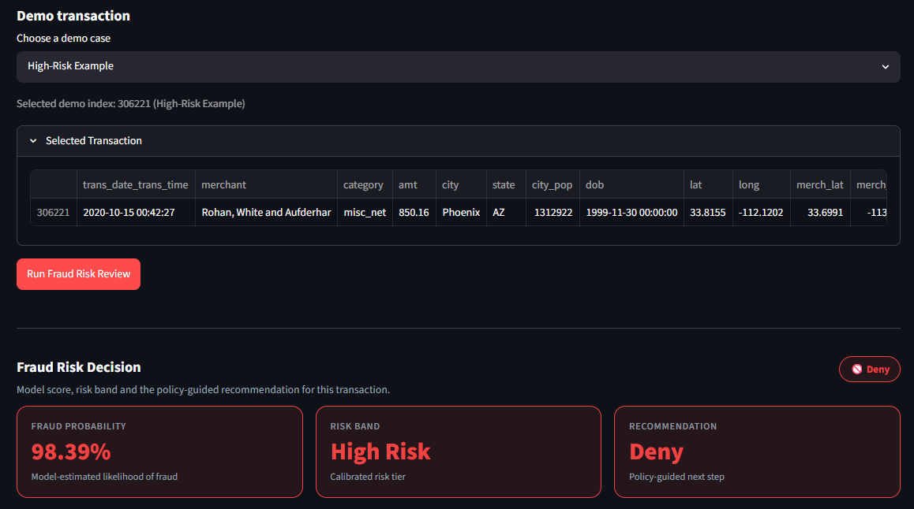
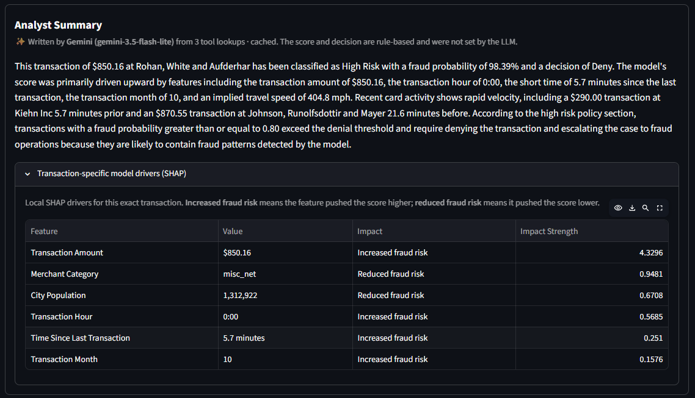
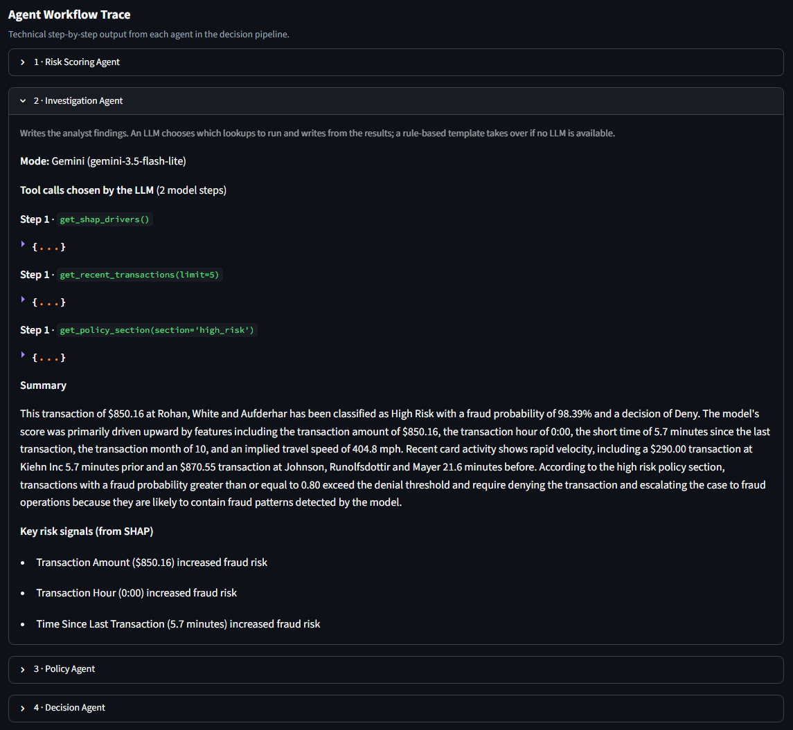
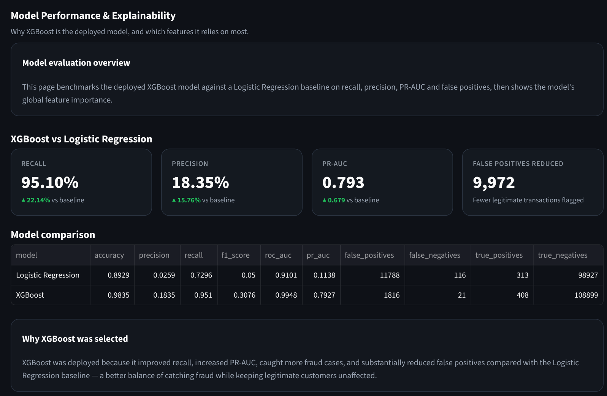
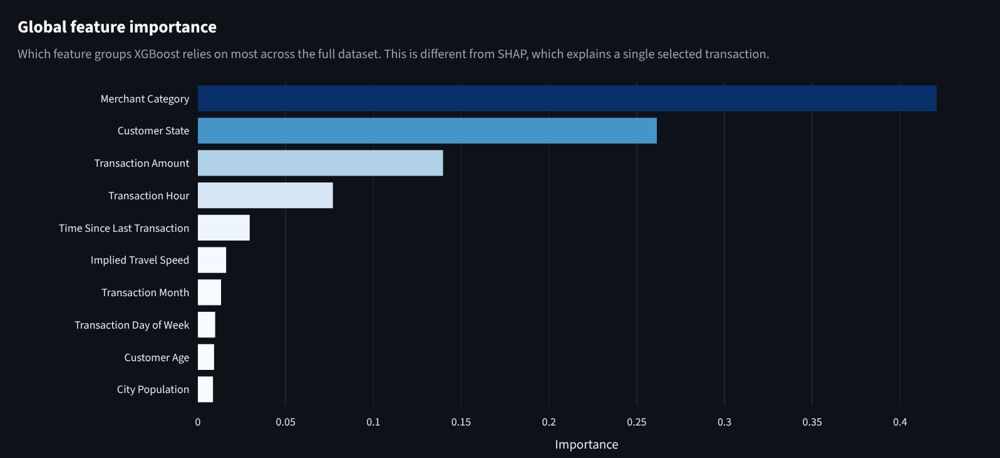
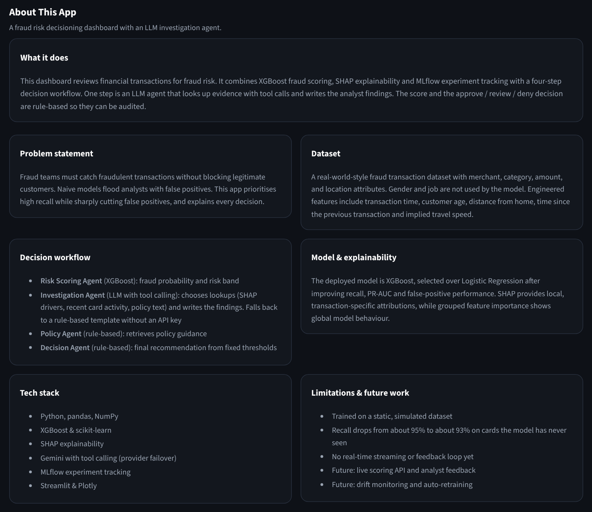

# 🛡️ FraudGuard: Fraud Risk Decisioning Dashboard with an LLM Investigation Agent

A fraud risk decisioning system built with XGBoost, SHAP explainability and MLflow experiment tracking. Each transaction gets a fraud score, a rule-based approve / manual review / deny decision, and analyst findings written by an LLM agent (Gemini) that uses tool calling to look up its own evidence.

**[🚀 Live Demo →](https://fraudguard-dashboard.streamlit.app)**

---

## What It Does

Fraud teams face a core tension: catch as much fraud as possible without blocking legitimate customers. This dashboard addresses that by:

- Scoring each transaction with an XGBoost model tuned for **high recall** while sharply reducing false positives
- Explaining *why* a transaction was scored the way it was using **SHAP**, per transaction
- Turning the score into a decision with **fixed, auditable thresholds** (no LLM involved)
- Having an **LLM investigation agent** choose which lookups to run (SHAP drivers, the card's recent transactions, the written fraud policy) and write the analyst findings from what it retrieved
- Opening on a **demo transaction**, with **CSV upload** for your own data

---

## Screenshots

### High-Risk Transaction: Fraud Risk Decision


### Analyst Summary and SHAP Explainability


### Workflow Trace


### Model Performance: XGBoost vs Logistic Regression


### Global Feature Importance


### About This App


---

## Model Performance

Evaluated on a held-out 20% of 555,719 transactions (111,144 rows, 429 fraud cases), at a 0.5 threshold.

| Model | Recall | Precision | PR-AUC | False Positives | False Negatives |
|---|---|---|---|---|---|
| Logistic Regression (baseline) | 72.96% | 2.59% | 0.114 | 11,788 | 116 |
| **XGBoost (deployed)** | **95.10%** | **18.35%** | **0.793** | **1,816** | **21** |

XGBoost against the baseline:
- **+22.1 points** of recall (72.96% → 95.10%)
- **85% fewer** false positives (11,788 → 1,816)
- **82% fewer** false negatives (116 → 21)
- **PR-AUC 0.114 → 0.793**

Precision is 18%: about 4 in 5 flagged transactions are legitimate. That is why flagged transactions go to review bands instead of being denied outright at 0.5.

### Robustness checks

These are in `src/ablation.py` and `reports/feature_ablation.csv`.

**Gender and job were removed from the model.** Gender is a protected attribute. Job described the cardholder, not the transaction, and in this dataset it worked like a customer ID: it was the top feature by XGBoost importance (36%), yet removing it left recall unchanged and moved PR-AUC by 0.006.

**Unseen customers.** The headline numbers use a random split, so the same card can appear in both training and test data. Holding out entire cards instead gives the model's performance on customers it has never seen:

| Split | Recall | Precision | PR-AUC |
|---|---|---|---|
| Random (headline) | 95.10% | 18.35% | 0.793 |
| By card (unseen customers) | 93.13% | 20.04% | 0.729 |

---

## Decision Workflow

Each transaction passes through four steps. Only one of them uses an LLM.

| Step | How it works | Role |
|---|---|---|
| **Risk Scoring Agent** | XGBoost | Fraud probability and risk band |
| **Investigation Agent** | LLM with tool calling | Chooses lookups, then writes the analyst findings |
| **Policy Agent** | Rule-based | Retrieves the matching policy guidance |
| **Decision Agent** | Rule-based | Final recommendation from fixed thresholds |

Risk bands and recommendations:
- 🟢 **Low Risk** (< 0.30) → Approve
- 🟡 **Medium Risk** (0.30–0.80) → Manual Review
- 🔴 **High Risk** (≥ 0.80) → Deny + Escalate

### The Investigation Agent

The LLM is given three tools and decides which to call:

| Tool | Returns |
|---|---|
| `get_shap_drivers` | Which features raised or lowered this transaction's score |
| `get_recent_transactions` | The card's most recent earlier transactions |
| `get_policy_section` | A section of `data/policies/fraud_policy.md` |

Guardrails:
- **The LLM does not decide anything.** The score comes from the model and the decision from fixed thresholds, so every decision can be audited.
- **The LLM does not produce numbers.** Every number in its summary must appear in the evidence it was given. A summary containing any other number is rejected.
- **Failover.** Models are tried in order (`LLM_CHAIN`). If there is no API key, the API is down, the free-tier limit is hit, or a summary is rejected, the app uses a rule-based template built from the same SHAP output. The app works with no key at all.
- **Cost controls.** One LLM summary per transaction is cached, tool-calling is capped at 4 model steps, and LLM use is rate-limited per minute and per day.
- **Transparency.** The UI shows whether Gemini or the template wrote each summary, and the workflow trace lists every tool call the agent made.

Adding another provider (OpenAI, Claude) means writing one class in `src/llm_client.py`, registering it, and adding it to `LLM_CHAIN`.

---

## Feature Engineering

The model uses 13 features: 9 engineered and 4 taken directly from the data (amount, merchant category, customer state, city population).

Engineered features:
- **Transaction velocity**: time since the card's last transaction
- **Geospatial distance**: haversine distance from customer home to merchant, and from the previous merchant
- **Implied travel speed**: distance ÷ time since the last transaction (flags physically impossible trips)
- **Temporal features**: hour, day of week, month, weekend flag
- **Customer age**: derived from date of birth

---

## Tech Stack

| Layer | Tools |
|---|---|
| **ML Model** | XGBoost, Scikit-learn, Logistic Regression (baseline) |
| **Explainability** | SHAP (TreeExplainer, per transaction) |
| **LLM** | Gemini via `google-genai`, tool calling, provider failover |
| **Experiment Tracking** | MLflow |
| **Frontend** | Streamlit, Plotly |
| **Data Processing** | Pandas, NumPy |
| **Testing / CI** | pytest, GitHub Actions |

---

## Project Structure

```
Fraud-risk-decisioning-dashboard/
├── app/
│   └── streamlit_app.py        # Streamlit UI entry point
├── src/
│   ├── agents/
│   │   ├── risk_scoring_agent.py
│   │   ├── investigation_agent.py   # LLM agent + template fallback
│   │   ├── investigation_tools.py   # Tools the LLM can call
│   │   ├── policy_agent.py
│   │   ├── decision_agent.py
│   │   └── fraud_decision_workflow.py
│   ├── llm_client.py           # Providers, tool loop, failover, rate limit, cache
│   ├── prompts.py              # LLM system and user prompts
│   ├── predict.py              # XGBoost inference and thresholds
│   ├── preprocessing.py        # Feature engineering
│   ├── shap_explainer.py       # SHAP explanations
│   ├── policy_retriever.py     # Policy lookup
│   ├── train_model.py          # Training + MLflow logging
│   ├── ablation.py             # Gender / job / split robustness checks
│   └── config.py               # Path configuration
├── tests/                      # pytest suite (fake LLM providers, no key needed)
├── scripts/
│   └── keep_awake.py           # Used by the keep-awake GitHub Action
├── .github/workflows/          # CI and keep-awake
├── models/
│   ├── real_world_xgboost_model.joblib   # Deployed model
│   └── legacy/                 # Models from the first version
├── data/
│   ├── sample/                 # Bundled sample dataset (518 rows)
│   └── policies/
│       └── fraud_policy.md
├── reports/                    # Model comparison, importance and ablation CSVs
├── notebooks/legacy/           # First-version notebooks (anonymized Kaggle dataset)
├── assets/
│   └── screenshots/
├── requirements.txt            # App dependencies
└── requirements-dev.txt        # Adds MLflow and pytest
```

---

## Running Locally

```bash
# Clone the repo
git clone https://github.com/Shardul-Pandit/Fraud-risk-decisioning-dashboard.git
cd Fraud-risk-decisioning-dashboard

# Create and activate a virtual environment
python -m venv .venv
.venv\Scripts\activate  # Windows
source .venv/bin/activate  # Mac/Linux

# Install dependencies
pip install -r requirements.txt

# Run the app
streamlit run app/streamlit_app.py
```

### LLM setup (optional)

Without an API key the app runs fully, using the rule-based template for the summary. To turn on the LLM agent:

1. Get a free Gemini API key at [aistudio.google.com/apikey](https://aistudio.google.com/apikey).
2. Copy `.env.example` to `.env` and set `GEMINI_API_KEY`. On Streamlit Community Cloud, add it under the app's **Settings → Secrets** instead.

`.env` and `.streamlit/secrets.toml` are gitignored. Model names and limits are configurable in the same place (see `.env.example`).

### Retraining and tests

```bash
pip install -r requirements-dev.txt
python -m src.train_model          # needs data/raw/fraudTest.csv, logs to MLflow
python -m src.feature_importance
python -m src.ablation
pytest
```

---

## Dataset

A simulated credit card transaction dataset (`fraudTest.csv`, 555,719 transactions, 0.39% fraud) with merchant, category, amount, location and customer attributes. A bundled sample of 518 rows, including the three demo transactions and the recent history of the high-risk demo card, ships with the repo for demo mode. The full file is not committed because of its size.

The project started on the anonymized Kaggle credit card dataset (284,807 transactions, features V1 to V28) and moved to this one because named features allow feature engineering and readable explanations. The original notebooks and models are kept under `notebooks/legacy/` and `models/legacy/`.

---

## Limitations & Future Work

- The data is simulated and static, so results will not transfer directly to real card data
- Customer state is the model's second most important feature and may partly identify customers; the by-card split above measures that effect
- Precision is 18% at the 0.5 threshold; thresholds are not yet tuned against review cost
- No live analyst feedback loop, drift monitoring or retraining pipeline yet

---

## Author

**Shardul Pandit**
B.S. Data Science, Montclair State University | Cum Laude

[LinkedIn](https://www.linkedin.com/in/shardulpandit/) • [GitHub](https://github.com/Shardul-Pandit)
